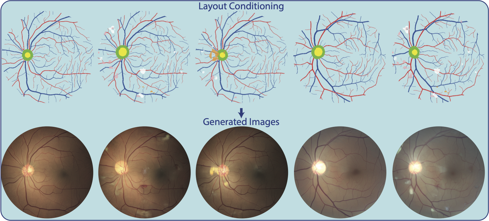

<h1 align="center">
  <br>
Enhancing Retinal Vessel Segmentation Generalization via Layout-Aware Generative Modelling</h1>



## Installation

First, clone this repository and run install the environment:
```bash
cd RLAD
python -m venv RLAD_env
source RLAD_env/bin/activate
pip install --upgrade pip
pip install -e .
```

## Data preparation
Download the following datasets from their official website:
[UZLF_TRAIN](https://rdr.kuleuven.be/dataset.xhtml?persistentId=doi:10.48804/Z7SHGO), [GRAPE](https://springernature.figshare.com/collections/GRAPE_A_multimodal_glaucoma_dataset_of_followup_visual_field_and_fundus_images_for_glaucoma_management/6406319/1), [MESSIDOR](https://www.adcis.net/en/third-party/messidor/), [PAPILA](https://figshare.com/articles/dataset/PAPILA/14798004), [MAGREB](https://deepblue.lib.umich.edu/data/concern/data_sets/3b591905z), [ENRICH](https://www.kaggle.com/datasets/fhimjo15/reyia-dataset/data), [1000images](https://www.kaggle.com/datasets/linchundan/fundusimage1000),[ddr_lesion_train](https://www.kaggle.com/competitions/diabetic-retinopathy-detection/data), [EYEPACS](https://www.kaggle.com/competitions/diabetic-retinopathy-detection),[G1020](https://www.kaggle.com/datasets/arnavjain1/glaucoma-datasets),[idrid_lesion_train](https://idrid.grand-challenge.org/Data/),[ODIR_Train](https://www.kaggle.com/datasets/andrewmvd/ocular-disease-recognition-odir5k),
[UZLF_VAL](https://rdr.kuleuven.be/dataset.xhtml?persistentId=doi:10.48804/Z7SHGO) and [DRTiD](https://github.com/fdu-vts/drtid).

Then organize them as follow:
   
    ├── RLAD
    ├── Databases
    │   ├── Database_Name_1
    │   │   ├── images
    │   │   │   ├── image_name1.png   
    │   │   │   ├── image_name2.png
    │   │   │   ... 
    │   ├── Database_Name_2
    │   │   ├── images
    │   │   │   ├── image_name1.png   
    │   │   │   ├── image_name2.png
    │   │   │   ...
    │   ├── Database_Name_3
    │   │   ├── images
    ...


## Training
Run the following command:
(Original RLAD model have been trained using 4 A100-40gb GPUs).
```bash
cd RLAD/Runs
bash train.sh
```

## Generate Images
To customize the image generation process, modify the following fields in configs/configsDiT/RLAD.yaml: 
- load_weights_from: Set the path of the checkpoint you want to use (default is the model used in RLAD paper)
- CD_cond: Set to True if you want the model to use optic cup and disc conditioning during generation. Set to False to allow the model to decide freely, without this conditioning.
- L_cond: Set to True to provide lesion conditioning for the generation process. Set to False to let the model generate images without lesion conditioning.
- n_gen_per_samples: The number of different sample of the same conditioning to generate

After updating the configuration file, generate images by running:
```bash
cd RLAD/Runs
bash generate_images.sh
```

## Compute FID and RET-FD
After generating some augmented images for a given test dataset (see the configs/configsDiT/RLAD.yaml) run:
```bash
cd RLAD
source RLAD_env/bin/activate
python Scripts/compute_FD.py --yaml configs/configsDiT/RLAD.yaml --bs 160
```

## Main Results

### Evaluation of Realism

| **Gen Model**             | **Conditioning**    | **FID** ↓ | **RET-FD** ↓ |
|---------------------------|---------------------|-----------|--------------|
| StyleGAN [1]              | L                   | 138.0     | 120.8        |
| StyleGAN2 [2]             | Demographics        | 98.1      | 116.0        |
| StyleGAN2<sup>†</sup> [3] | AV                  | 122.8     | -            |
| Pix2PixHD<sup>†</sup> [3] | AV                  | 86.8      | -            |
| **RLAD (Ours)**           | AV + L + CD         | **30.3**  | **79.7**     |

**Table:** *Realism of Generated Images.* Lower FID and RET-FD on the DRTiD dataset indicate closer alignment with real data, reflecting realism. Notably, **RLAD** is able to generate controllable and more realistic retinal images. Models marked <sup>†</sup> were trained and evaluated on private data.

### Improved performance using RLAD as random data augmentation
(with no CD and Lesion conditioning during generation and 15 generated image per sample)
<table>
  <thead>
    <tr>
      <th><b>Backbone</b></th>
      <th><b>Avg In-Domain</b></th>
      <th><b>Avg Near-Domain</b></th>
      <th><b>Avg Out-of-Domain</b></th>
    </tr>
  </thead>
  <tbody>
    <tr>
      <td>Little W-Net [4]</td>
      <td>-</td>
      <td>67.9</td>
      <td>45.5</td>
    </tr>
    <tr>
      <td>Automorph [5]</td>
      <td>80.2</td>
      <td>71.7<sup>†</sup></td>
      <td>57.9<sup>†</sup></td>
    </tr>
    <tr>
      <td>VascX [6]</td>
      <td>81.2</td>
      <td>76.0</td>
      <td>60.5</td>
    </tr>
    <tr>
      <td>LUNet [7]</td>
      <td>83.4</td>
      <td>77.3</td>
      <td>61.1</td>
    </tr>
    <tr><td colspan="4"></td></tr>
    <tr>
      <td>DinoV2<sub>small</sub> [8]</td>
      <td>82.0</td>
      <td>76.6</td>
      <td>64.0</td>
    </tr>
    <tr style="background-color:#C5E6F2;">
      <td><b>+ RLAD (Ours)</b></td>
      <td><b>82.3</b></td>
      <td><b>77.5</b></td>
      <td><b>66.6</b></td>
    </tr>
    <tr>
      <td>RETFound [9]</td>
      <td>81.8</td>
      <td>76.9</td>
      <td>65.2</td>
    </tr>
    <tr style="background-color:#C5E6F2;">
      <td><b>+ RLAD (Ours)</b></td>
      <td><b>83.4</b></td>
      <td><b>79.9</b></td>
      <td><b>69.9</b></td>
    </tr>
    <tr>
      <td>SwinV2<sub>tiny</sub> [10]</td>
      <td>83.1</td>
      <td>79.6</td>
      <td>68.9</td>
    </tr>
    <tr style="background-color:#C5E6F2;">
      <td><b>+ RLAD (Ours)</b></td>
      <td><b>83.3</b></td>
      <td><b>79.9</b></td>
      <td><b>70.8</b></td>
    </tr>
    <tr>
      <td>SwinV2<sub>large</sub> [10]</td>
      <td>83.4</td>
      <td>80.5</td>
      <td>72.1</td>
    </tr>
    <tr style="background-color:#C5E6F2;">
      <td><b>+ RLAD (Ours)</b></td>
      <td><b>83.4</b></td>
      <td><b>80.7</b></td>
      <td><b>72.5</b></td>
    </tr>
  </tbody>
</table>


**Table:** *Average Dice scores for artery and vein segmentation across In-Domain, Near-Domain, and Out-of-Domain datasets. RLAD denotes results with our method. <sup>†</sup> indicates data leakage during training.*

### References

1. Benjamin Hou, Amir Alansary, Daniel Rueckert, and Bernhard Kainz. High-fidelity diabetic retina fundus
image synthesis from freestyle lesion maps, 2022. 
2. Sarah Müller, Lisa M. Koch, P. A. Lensch, Hendrik, and Philipp Berens. Disentangling representations of
retinal images with generative models, 2024.
3. Sojung Go, Younghoon Ji, Sang Jun Park, and Soochahn Lee. Generation of structurally realistic retinal
fundus images with diffusion models. In IEEE/CVF Conference on Computer Vision and Pattern Recogni-
tion Workshops (CVPRW), pages 2335–2344, Seattle, WA, USA, 2024.
4. Adrian Galdran, André Anjos, José Dolz, Hadi Chakor, Hervé Lombaert, and Ismail Ben Ayed. State-of-the-
art retinal vessel segmentation with minimalistic models. Scientific Reports, 12(1):6174, 2022.
5. Yukun Zhou, Siegfried K Wagner, Mark A Chia, An Zhao, Moucheng Xu, Robbert Struyven, Daniel C
Alexander, Pearse A Keane, and others. AutoMorph: automated retinal vascular morphology quantification
via a deep learning pipeline. Translational Vision Science & Technology, 11(7):12, 2022.
6. Jose Vargas Quiros, Bart Liefers, Karin van Garderen, Jeroen Vermeulen, Eyened Reading Center, Sinergia
Consortium, and Caroline Klaver. VascX models: Model ensembles for retinal vascular analysis from
color fundus images, 2024.
7. Jonathan Fhima, Jan Van Eijgen, Marie-Isaline Billen Moulin-Romsée, Heloı¨se Brackenier, Hana Ku-
lenovic, Valérie Debeuf, Marie Vangilbergen, Moti Freiman, Ingeborg Stalmans, and Joachim A Be-
har. LUNet: deep learning for the segmentation of arterioles and venules in high resolution fundus
images. Physiological Measurement, 45(5):055002, 2024.
8. Maxime Oquab, Timothée Darcet, Théo Moutakanni, Huy Vo, Marc Szafraniec, Vasil Khalidov, Pierre
Fernandez, Daniel Haziza, Francisco Massa, Alaaeldin El-Nouby, and others. Dinov2: Learning
robust visual features without supervision. arXiv preprint arXiv:2304.07193, 2023.
9. Yukun Zhou, Mark A Chia, Siegfried K Wagner, Murat S Ayhan, Dominic J Williamson, Robbert R
Struyven, Timing Liu, Moucheng Xu, Mateo G Lozano, Peter Woodward-Court, and others. A
foundation model for generalizable disease detection from retinal images. Nature, 622(7981):156–
163, 2023.
10. Ze Liu, Han Hu, Yutong Lin, Zhuliang Yao, Zhenda Xie, Yixuan Wei, Jia Ning, Yue Cao, Zheng Zhang,
Li Dong, and others. Swin transformer v2: Scaling up capacity and resolution. In 2022 IEEE/CVF
Conference on Computer Vision and Pattern Recognition (CVPR), pages 12009–12019, 2022.


### LICENSE
This project is licensed under the Creative Commons Attribution-NonCommercial 4.0 International License, [see LICENSE file](LICENSE), which prohibits commercial use.


    
